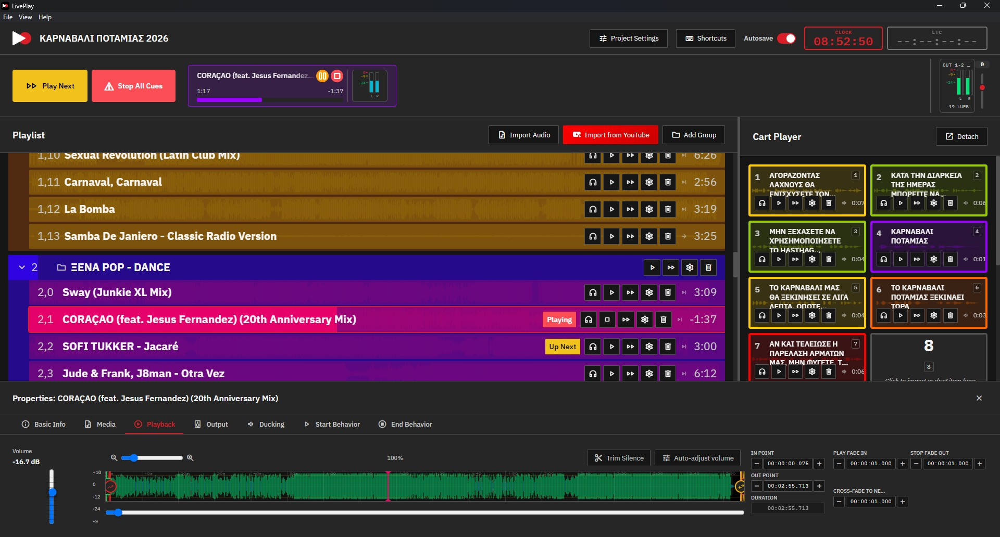

# LivePlay



**LivePlay** is a free, open-source audio playback system for live sound operators who need reliable, flexible cue management. It is built around a **decoupled client/server architecture**: a headless C++ audio engine handles all sound, while a cross-platform Electron desktop app drives it as a remote control.

Made with some help from Claude Sonnet 4.5, Claude Sonnet 4.6 and Claude Opus 4.8

- 🎚 Multi-device output routing (FOH + monitors + comms + record bus, all at once)
- 🎬 Per-cue SMPTE LTC generator
- 🔊 Brick-wall master limiter on every output
- 📊 Three-stage real-time metering (per-cue, mixer-channel, master)
- 🌐 REST + WebSocket control surface — run the server on a stage-side machine and operate it remotely from the show laptop
- 🌍 Localised in **20 languages** with full RTL support
- 📦 Native installers for **Windows, macOS (Intel + Apple Silicon) and Linux**

---

## Table of contents

- [What LivePlay does](#what-liveplay-does)
- [Installing and using LivePlay](#installing-and-using-liveplay)
- [Repository layout](#repository-layout)
- [Building from source](#building-from-source)
  - [Prerequisites](#prerequisites)
  - [Windows](#windows)
  - [macOS](#macos)
  - [Linux](#linux)
- [Development workflow](#development-workflow)
- [Releases & GitHub Actions](#releases--github-actions)
- [Contributing](#contributing)
- [License](#license)

---

## What LivePlay does

LivePlay is a cue-playback application aimed at theatre, conferences, AV installs, and live performance. The operator builds a **project** (a `.liveplay` file plus a folder of media) containing:

- **A playlist** of audio cues organised into nested groups, with per-cue volume, in/out trim, fade times, ducking behaviour, and start/end behaviours (play next, loop, jump to cue, …).
- **A cart grid** of one-touch buttons mapped to cues for stings, SFX and walk-ons.
- **A routing matrix** that maps cue source channels → mixer channels → master outputs → physical hardware outputs across one or more sound cards.

At showtime, the operator triggers cues via the UI, the cart grid, configured keyboard shortcuts, MIDI controllers, or HTTP/WebSocket calls from external automation. Each cue plays through its own decoder, runs through a three-tier mixer, and lands on a brick-wall limiter before hitting the DAC.

### Architecture in one diagram

```
+--------------------------------+   WebSocket (ws://host:4480/ws)   +-----------------------------------+
|  client/                       | <----- meters @ ~60 Hz ---------> |  server/  (liveplay-server)       |
|  Electron + Nuxt 3 + Vue 3     | <----- transport / route cmds --- |  C++20, miniaudio, Crow, TagLib   |
|                                |        REST  (http://host:4480)   |                                   |
|  - Playlist / cart / routing UI| <----- list / load / waveform --> |  - AudioEngine (mixer + limiter)  |
|  - WaveformCanvas              |                                   |  - ProjectState (.liveplay I/O)   |
|  - LiveMeterBar                |                                   |  - ControlServer (REST + WS)      |
|                                |                                   |  - Metadata + waveform services   |
|  No audio plays in the         |                                   |                                   |
|  renderer process.             |                                   |  Win → WASAPI · Mac → CoreAudio   |
|                                |                                   |  Linux → ALSA / PulseAudio        |
+--------------------------------+                                   +-----------------------------------+
```

Client and server can run on **the same machine** (the desktop installer bundles both) or on **different machines** on a LAN — e.g. the show laptop driving a stage-side mini-PC that's wired to the actual sound interfaces.

For the deep architectural docs (mixer tiers, routing matrix, LTC, limiter, metering, network event lifecycle, project-file backwards compatibility), see [`server/README.md`](server/README.md).

---

## Installing and using LivePlay

### Download a release

Pre-built installers for Windows, macOS and Linux are published on the [GitHub Releases page](https://github.com/tdoukinitsas/liveplay/releases) and from the [docs site](https://tdoukinitsas.github.io/liveplay/).

| Platform | Files |
|----------|-------|
| Windows  | `LivePlay.Setup.x.y.z.exe` (NSIS installer, x64) |
| macOS (Apple Silicon) | `LivePlay-x.y.z-arm64.dmg` (also `-arm64-mac.zip`) |
| macOS (Intel) | `LivePlay-x.y.z.dmg` (also `-mac.zip`) |
| Linux    | `LivePlay-x.y.z.AppImage`, `liveplay_x.y.z_amd64.deb`, `liveplay-x.y.z.x86_64.rpm` |

macOS ships as **two separate per-architecture builds** — pick the Apple Silicon (`arm64`) build for M1/M2/M3 (and newer) Macs, and the Intel build for older Intel Macs.

The installer bundles **both** the Electron client and the `liveplay-server` binary. On first launch the client spawns the server as a child process listening on `127.0.0.1:4480`, so a single-machine install needs no configuration.

LivePlay auto-checks for new releases on launch and offers in-app updates via `electron-updater`.

### Network ports

A single-machine install talks to itself over `127.0.0.1` and needs nothing opened. When the client and server run on **different machines** on a LAN, make sure these ports are reachable through any firewalls in between:

| Port | Protocol | Used for |
|------|----------|----------|
| `4480` | TCP | Control surface — REST API + WebSocket (transport, project data, routing, live meters). |
| `4481` | UDP | LAN auto-discovery beacon (broadcast + multicast group `239.255.69.80`). Lets clients find servers without typing an IP. |

On Windows the NSIS installer adds the necessary inbound firewall rules at install time; the app also makes a best-effort runtime pass if run elevated. On macOS/Linux, allow the `liveplay-server` binary through your firewall if you operate it remotely.

### Quick start

1. Install LivePlay and launch it.
2. Choose **New Project** and pick a folder — LivePlay creates the project file and a `media/` sub-folder there.
3. Drop audio files onto the playlist, or use **Import audio** to copy them in.
4. Click a cue to load it into the Properties panel, set in/out points, fade times, and routing.
5. Press a cart slot or hit the Play button to fire the cue. Live meters show signal at every stage.

For routing a stage-side server, open **Server Settings** and point the client at `http://<server-host>:4480`.

---

## Repository layout

```
liveplay/
├── client/         Electron + Nuxt 3 + Vue 3 desktop UI — see client/README.md
├── server/         C++20 audio engine + REST/WS control server — see server/README.md
├── docs-site/      Public-facing Nuxt 3 site (GitHub Pages) — see docs-site/README.md
├── scripts/        Cross-platform build orchestrator scripts — see scripts/README.md
├── build/          Collected installer artefacts after `npm run build`
├── .github/workflows/
│   ├── build-release.yml   Cuts releases on version bumps to package.json
│   ├── build-server.yml    Standalone server matrix build (Win / macOS / Linux)
│   └── deploy-docs.yml     Publishes the docs site to GitHub Pages
├── package.json    Monorepo root — orchestrator scripts only
├── LICENCE.txt     AGPL-3.0-only
└── README.md       This file
```

Each sub-package has its own README with developer documentation tailored to that area.

---

## Building from source

### Prerequisites

All platforms need:

| Tool | Minimum | Notes |
|------|---------|-------|
| Git  | any     | |
| Node.js | 20 LTS | for the client + orchestrator scripts |
| CMake | 3.21   | for the server |
| C++20 toolchain | — | MSVC 2022 / Clang 15+ / GCC 12+ |
| [vcpkg](https://github.com/microsoft/vcpkg) | recent | `VCPKG_ROOT` env var must point at your checkout |
| Ninja | latest | strongly recommended (`brew install ninja`, `choco install ninja`, `apt install ninja-build`) |

Set the `VCPKG_ROOT` environment variable:

```pwsh
# Windows (PowerShell, persistent)
[Environment]::SetEnvironmentVariable("VCPKG_ROOT", "C:\dev\vcpkg", "User")
```

```sh
# macOS / Linux
export VCPKG_ROOT="$HOME/dev/vcpkg"
echo 'export VCPKG_ROOT="$HOME/dev/vcpkg"' >> ~/.zshrc
```

Then from a clean checkout:

```sh
git clone https://github.com/tdoukinitsas/liveplay.git
cd liveplay
npm install                # installs client deps via npm workspaces
npm run build              # builds server + client and collects installers into /build
```

`npm run build` runs the unified pipeline in [scripts/build-all.js](scripts/build-all.js):

1. Configures and builds the C++ server through CMake/vcpkg.
2. On macOS, wraps the server binary into a `LivePlay Server.app` for DMG inclusion.
3. Runs `nuxt generate` and `electron-builder` in `client/`.
4. Copies the installer artefacts (`.exe`, `.dmg`, `.AppImage`, `.deb`, `.rpm`) into `build/`.

Use `npm run build:clean` to wipe previous build outputs first (it preserves `vcpkg_installed/` so C++ deps don't get re-downloaded).

#### Platform-specific notes

##### Windows

- Install **Visual Studio 2022** with the *Desktop development with C++* workload (includes MSVC + Windows SDK).
- Install Node.js 20 LTS, CMake (≥ 3.21) and Ninja (e.g. `choco install nodejs cmake ninja`).
- Clone and bootstrap vcpkg:
  ```pwsh
  git clone https://github.com/microsoft/vcpkg C:\dev\vcpkg
  C:\dev\vcpkg\bootstrap-vcpkg.bat
  ```
- Set `VCPKG_ROOT` (see above), open a fresh PowerShell, `npm install`, then `npm run build`.
- Output: `build/LivePlay Setup <version>.exe` (NSIS installer, x64). GitHub rewrites the spaces to dots on the release asset (`LivePlay.Setup.<version>.exe`).

##### macOS

- Install Xcode Command Line Tools (`xcode-select --install`).
- Install Homebrew deps: `brew install node cmake ninja pkg-config`.
- Bootstrap vcpkg:
  ```sh
  git clone https://github.com/microsoft/vcpkg "$HOME/dev/vcpkg"
  "$HOME/dev/vcpkg"/bootstrap-vcpkg.sh
  ```
- Set `VCPKG_ROOT`, then `npm install && npm run build`.
- Output: `build/LivePlay-<version>.dmg` on Intel, or `build/LivePlay-<version>-arm64.dmg` on Apple Silicon (each with a matching `.zip`). CI builds both x64 and arm64 separately — to build the other arch locally, set `CMAKE_OSX_DEPLOYMENT_TARGET` and pass the matching electron-builder flags.
- Code signing is skipped by default (users will see a Gatekeeper warning on first launch — right-click → Open).

##### Linux

- Install build tools and audio dev headers:
  ```sh
  sudo apt update
  sudo apt install -y build-essential cmake ninja-build pkg-config \
                      libasound2-dev libpulse-dev libjack-jackd2-dev libx11-dev
  ```
  (use the equivalent `dnf` / `pacman` packages on Fedora / Arch).
- Install Node.js 20 LTS via your distro or [nvm](https://github.com/nvm-sh/nvm).
- Bootstrap vcpkg as on macOS, set `VCPKG_ROOT`, then `npm install && npm run build`.
- Output: `build/LivePlay-<version>.AppImage`, `liveplay_<version>_amd64.deb`, `liveplay-<version>.x86_64.rpm`.

---

## Development workflow

From the monorepo root:

```sh
# One-time
npm install                      # installs client deps via npm workspaces
npm run server:configure         # CMake configure for the server (idempotent)

# Iterating on the server only
npm run server:build             # rebuild the C++ server
npm run server:run               # launch the compiled binary (forwards CLI args)

# Iterating on the client only — ensures the server is built first, then runs
# Nuxt + Electron in dev mode against it
npm run dev

# Running both in side-by-side terminals (the server in one pane, client dev in the other)
npm run dev:all
```

The default `npm run dev` calls [scripts/ensure-server.js](scripts/ensure-server.js), which is a no-op if the server binary already exists and otherwise configures + builds it. After that it launches `nuxt dev` + Electron in the `client/` workspace.

Bumping versions across the monorepo:

```sh
npm run bump -- patch        # 2.0.0 → 2.0.1
npm run bump -- minor        # 2.0.0 → 2.1.0
npm run bump -- major        # 2.0.0 → 3.0.0
npm run version -- 2.1.4     # set an explicit version
```

For deeper development notes:

- **Server internals** (mixer tiers, routing, LTC, project-file format, REST/WS surface): [`server/README.md`](server/README.md)
- **Client internals** (composables, IPC, Electron main process, localisation, MIDI/hotkeys): [`client/README.md`](client/README.md)
- **Build/utility scripts**: [`scripts/README.md`](scripts/README.md)
- **Public docs site**: [`docs-site/README.md`](docs-site/README.md)

---

## Releases & GitHub Actions

Releases are fully automated. The release pipeline lives in [`.github/workflows/build-release.yml`](.github/workflows/build-release.yml).

### Triggering a release

1. Bump the version in the root `package.json` (use `npm run bump -- patch|minor|major`, which propagates to `client/package.json`).
2. Commit and push to `main`.
3. The `build-release` workflow detects the version change and runs the platform matrix:
   - **Windows x64** (MSVC, WASAPI)
   - **macOS Intel x64** (Clang, CoreAudio, deployment target 11.0)
   - **macOS Apple Silicon arm64** (Clang, CoreAudio, deployment target 12.0)
   - **Linux x64** (GCC, ALSA + PulseAudio + JACK)
4. Each job builds the C++ server through CMake/vcpkg, then runs the client `electron-builder` step with `extraResources` picking up the freshly compiled server binary.
5. All artefacts are uploaded, then a final `release` job downloads them, auto-generates a changelog from git commits since the last tag, and creates a GitHub Release tagged `v<version>` with every installer attached.

The vcpkg binary cache (`x-gha,readwrite` backend) is reused across runs so compiled C++ dependencies don't have to be re-built from scratch every time.

### Other workflows

- **[`build-server.yml`](.github/workflows/build-server.yml)** — builds the server alone on PRs and pushes that touch `server/**`. Cross-platform matrix; uploads `liveplay-server-<platform>` artefacts for download from the Actions UI. Useful for vetting server-only PRs without running the full release pipeline.
- **[`deploy-docs.yml`](.github/workflows/deploy-docs.yml)** — rebuilds [the docs site](https://tdoukinitsas.github.io/liveplay/) when `docs-site/`, the root `README.md`, or `package.json` changes.

---

## Contributing

Contributions of all sizes are welcome — bug fixes, new features, translations, documentation, screenshots, you name it.

1. **Fork** the repo and `git checkout -b feat/something` off `main`.
2. **Build it locally** following the steps above. For server changes, run `npm run server:build && npm run server:run --verbose`. For client changes, `npm run dev`.
3. **Test your change**. There's no automated test suite yet — please verify the path you touched works end-to-end in the running app. Mention any platform you couldn't test on in the PR description so reviewers can cover it.
4. **Open a PR** to `main`. CI must pass (server matrix build on the relevant platforms).

### Style

- **Server** (C++20): atomics for hot params on the audio thread, no exceptions inside the audio callback, RAII everywhere, header-per-class.
- **Client** (TypeScript): Vue 3 Composition API with `<script setup>`. All audio + project state goes through `useLiveplayServer()` — components don't talk to the server directly.
- **Commits**: short, prefer present-tense imperatives ("fix routing-matrix off-by-one"). Changelogs are generated from commit messages, so make them readable.

### Translations

LivePlay ships with 20 locale files at [`client/locales/`](client/locales/). To add a new language or fix existing translations:

1. Copy `en.json` to `<lang-code>.json` (e.g. `nl.json`).
2. Update the `_metadata` block (`code`, `name`, `nativeName`, `direction`).
3. Translate the values. Don't change keys; missing keys auto-fall-back to English at runtime.
4. Run `node scripts/sync-locale-keys.js` to ensure your new file has every key `en.json` has.
5. The locale is picked up automatically — no code changes needed.

For right-to-left languages, set `"direction": "rtl"` in `_metadata` and verify the layout in-app.

### Reporting bugs

File issues at [github.com/tdoukinitsas/liveplay/issues](https://github.com/tdoukinitsas/liveplay/issues). Include OS, LivePlay version (visible in the About dialog), and a minimal repro.

---

## License

[**AGPL-3.0-only**](LICENCE.txt). Third-party dependencies retain their own licences (miniaudio: public domain / MIT-0; Crow: BSD-3; TagLib: LGPL-2.1+; nlohmann/json: MIT).
