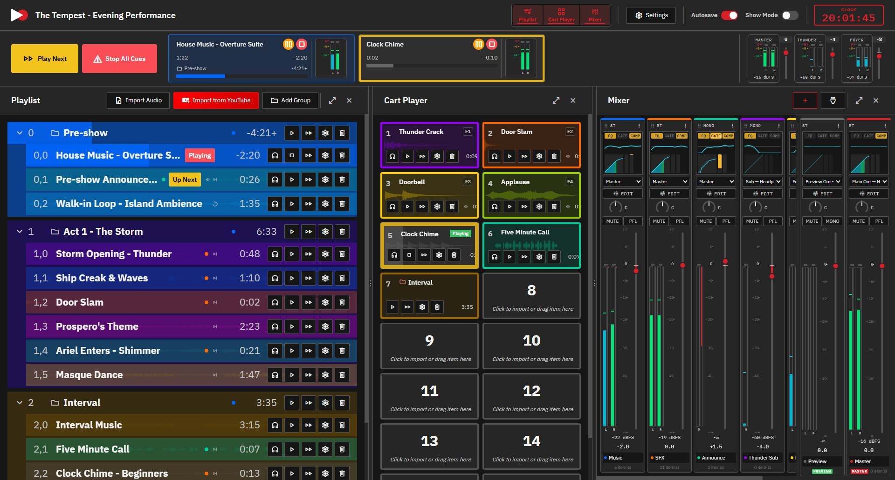

# LivePlay



**LivePlay is a free, open-source audio playback app for live shows.** Build cue lists, trigger sound effects, mix and route audio, and operate a show from the audio computer or another computer on the local network.

**[Download releases](https://github.com/tdoukinitsas/liveplay/releases)** · **[Website](https://tdoukinitsas.github.io/liveplay/)** · **[Report a problem](https://github.com/tdoukinitsas/liveplay/issues)**

## Features

- **Playlist and carts:** nested cue groups, one-touch buttons, trim points, fades, loops, crossfades and next-cue actions.
- **Show Mode:** a simplified playback view; detachable cart and mixer windows.
- **Mixing:** mono/stereo buses, EQ, gate, compressor, stereo width, pre-fade listening and auxiliary sends.
- **Outputs:** logical output names mapped to channels on one or more audio interfaces.
- **Monitoring:** cue, bus and output meters; loudness targets and a master limiter.
- **Control:** mouse, touch, keyboard, MIDI, HTTP and WebSocket automation.
- **Media:** drag-and-drop import, YouTube audio import, waveform display and LTC timecode output.
- **Remote operation:** a desktop controller connects to a local or remote audio server.
- **Languages:** localized interface with right-to-left support.

## Install

Download the installer matching your platform from [Releases](https://github.com/tdoukinitsas/liveplay/releases).

| Platform | Package |
|---|---|
| Windows x64 | `LivePlay-Setup-<version>.exe` |
| macOS Apple Silicon | `LivePlay-<version>-arm64.dmg` |
| macOS Intel | `LivePlay-<version>.dmg` |
| Linux x64 | AppImage, Debian `.deb`, or RPM `.rpm` |

The desktop package includes the audio server. A local installation does not require a separate server setup.

The repository's packaging does not configure Windows signing; macOS signing is disabled. If an installer is blocked, verify that it came from the project's release page before allowing it. On Windows, SmartScreen may offer **More info → Run anyway**. For a quarantined macOS installation you have verified, run:

```sh
xattr -rd com.apple.quarantine "/Applications/LivePlay.app"
```

See [packaging and signing](SIGNING.md) for contributor details.

## Start a show

1. Launch LivePlay and create a project in a folder for the show.
2. Open **Settings → Outputs** and map the show's logical outputs to your audio hardware.
3. Import audio or drop files into the playlist.
4. Select a cue and set its trim points, level, fades and end behavior.
5. Assign frequently used cues to cart buttons. Configure keyboard or MIDI controls if needed.
6. Check the output meters and audition through the Preview output.
7. Save the project, then switch to **Show Mode** for playback.

## Important settings

| Setting | What to check |
|---|---|
| Outputs | Map **Main Out** to the audience feed and **Preview Out** to headphones. An unmapped Main Out can use the default audio device; an unmapped Preview Out is silent. |
| Project / Output Target | Select the intended delivery target: EBU R128, Streaming, Radio, Netflix, or Live. This affects target levels and limiting. |
| Playback / Stop All | The project default is a 1-second Stop All fade, with preview also stopped. Individual cue stops use the cue's stop/fade settings. |
| Server | Choose the local server or a remote server address. Server boot configuration edits require a restart. |
| Users | On a shared network, create an administrator account and configure access. With authentication disabled, network clients can use administrative operations. |
| Appearance / Keyboard / Surfaces | Adjust presentation, keyboard bindings and MIDI controls for the operator and machine. |

Audio plays on the **server computer**. Remote file dialogs and media paths refer to that computer. Check its audio interface, output mapping and media availability before the show.

## Projects and media

- `.liveplay` stores the show document. Keep its media with it when moving a project.
- Export a `.lpa` archive to transfer a project with media; importing extracts it on the receiving server.
- **Save As does not copy media.** Use archive export/import when you need a portable package.
- The server copies the saved project file into a `backups/` folder every 10 minutes and retains up to 20 backup files. This backs up the saved document, not the audio files or unsaved edits.
- User profiles, hardware output mappings and machine window layouts are stored separately from the project.

## Remote operation

Run the audio server on the computer connected to the sound hardware. In the controller's server settings, select a discovered server or enter `http://<server-host>:4480`.

| Port | Protocol | Purpose |
|---|---|---|
| 4480 | TCP | HTTP control and WebSocket state/meters; configurable |
| 4481 | UDP | LAN discovery, including multicast group `239.255.69.80` |

Allow these through the server computer's firewall when using remote control. Discovery is optional if you enter the address manually. The Windows installer adds firewall rules; macOS/Linux permissions depend on the host configuration.

These interfaces carry control and state, not streamed audio. The server uses plain HTTP/WebSocket; use it on a trusted network. A local-only standalone server can bind to `127.0.0.1`.

## Troubleshooting

| Symptom | Check |
|---|---|
| Connected, but no audio | Cue media exists on the server; cue/bus is not muted; bus reaches a bound hardware output; device is available. |
| No headphone preview | Map Preview Out to headphone channels. Preview is intentionally silent when unbound. |
| Server not discovered | TCP connectivity, UDP 4481 and multicast availability. Try the server address directly. |
| Project opens with missing media | Restore the media folder or use the repair workflow to locate files on the server. |
| Clicks or dropouts | Check the selected device and server logs. Adjust render/ring buffer settings in Server settings and restart. |

When [reporting a problem](https://github.com/tdoukinitsas/liveplay/issues), include the LivePlay version, operating system, audio interface, whether the server is local or remote, reproduction steps and relevant logs. Remove passwords and tokens from logs.

## Developers

[Contributor guide](docs/README.md) · [Build and development](docs/DEVELOPMENT.md) · [Developer API Reference](https://tdoukinitsas.github.io/liveplay/api/) · [API source catalog](docs-site/public/api/reference.json)

LivePlay is licensed under AGPL-3.0-only.
